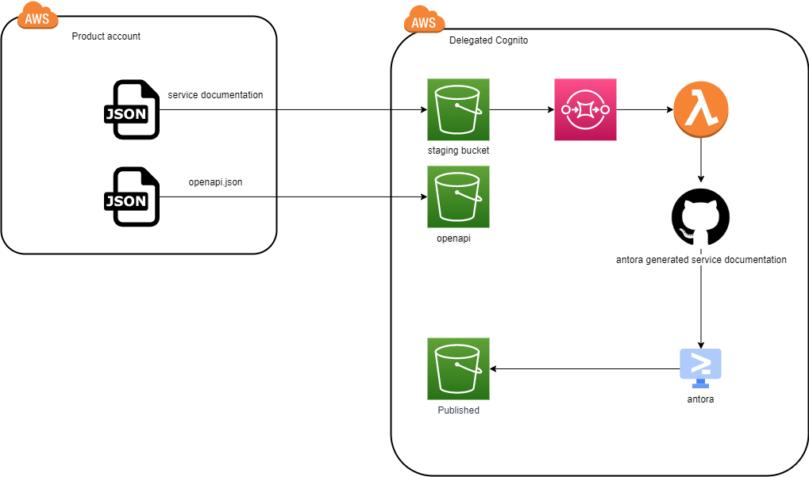

= servicedocumentation
:!toc-title:
:!toc-placement:
:toc:

A module for providing information and API doc for your application.

toc::[]

== About

This module will update link:https://developer.common-services.vydev.io/[the API overview page], and link:https://vygruppen.atlassian.net/wiki/spaces/INFRA/pages/6379864114/Service+Overview[the service overview page] based on the supplied information.

== Usage

To use this module, just add it to your application terraform!

For access credentials to the site:
link:https://github.com/nsbno/developer-portal/blob/master/README.adoc

[source,hcl]
----
module "servicedoc" {
  source = "github.com/nsbno/servicedocumentation?ref=x.y.z"

  current_account_id = data.aws_caller_identity.this.account_id
  application_name   = local.application_name
  env                = local.environment

  api_gateway_id = module.api_gateway.rest_api_id

  slack          = "#slackchannel"
  owner          = "budgetowner@vy.no"
  technicalowner = "tekniskowner@vy.no"
  servicesla     = "99.7"
  growthmetric   = "transaction count"
  aktivitetskode = "12345"
}
----

== Architecture

