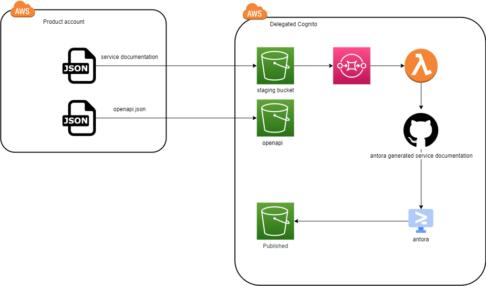

# servicedocumentation

This module will update https://developer.common-services.vydev.io/ and https://vygruppen.atlassian.net/wiki/spaces/INFRA/pages/6379864114/Service+Overview
with service information if added to application snippet.

Example code


```terraform
module "servicedoc" {
  source                      = "github.com/nsbno/servicedocumentation?ref=5da4430"  
  name_prefix                 = local.name_prefix
  env                         = local.environment
  current_account_id          = data.aws_caller_identity.this.account_id
  slack                       = "#slackchannel"
  owner                       = "budgetowner@vy.no"
  technicalowner              = "tekniskowner@vy.no"
  servicesla                  = "99.7"
  growthmetric                = "transaction count"
  aktivitetskode              = "12345"
  api_gateway_id              = "abcde31kh5"
}
```


